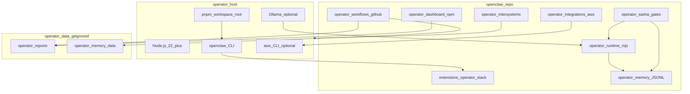

# System topology

- **Gateway** remains authoritative for model routing; `operator/runtime` is hints and diagnostics only.
- **Dashboard** reads copied JSON snapshots under `operator/dashboard/public/data/` (no live gateway socket).
